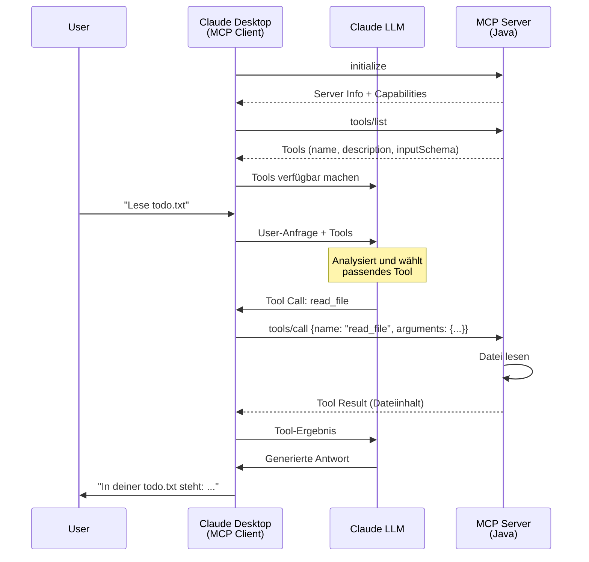

# Custom MCP Server

Ein Lernprojekt zur Implementierung eines MCP (Model Context Protocol) Servers in Java.

## Projektbeschreibung

Dieses Projekt dient dem Erlernen der Grundlagen des Model Context Protocol (MCP). Der Fokus liegt auf dem Verständnis, wie MCP Server funktionieren und wie sie mit Clients kommunizieren.

## Technologie-Stack

- **Java 17**
- **Spring Boot 3.2.0** - Dependency Injection und Application Framework
- **Maven** - Build-Tool
- **Jackson** - JSON Serialisierung/Deserialisierung
- **Lombok** - Reduzierung von Boilerplate Code

## Projekt-Architektur

Das Projekt folgt dem **ECB-Pattern** (Entity-Control-Boundary):

```
src/main/java/com/mcpserver/
├── entity/              # Domain-Objekte und Datenstrukturen
│   ├── JsonRpcRequest.java
│   ├── JsonRpcResponse.java
│   ├── JsonRpcError.java
│   ├── Tool.java
│   ├── Resource.java
│   └── ServerCapabilities.java
├── control/             # Business-Logik und Koordination
│   ├── McpServer.java
│   └── McpRequestHandler.java
└── boundary/            # Schnittstellen nach außen (I/O)
    └── StdioTransport.java
```

## Build und Ausführung

### Projekt bauen
```bash
mvn clean install
```

### Server starten
```bash
mvn spring-boot:run
```

### JAR bauen und ausführen
```bash
mvn package
java -jar target/custom-mcp-server-1.0-SNAPSHOT.jar
```

## MCP Konzepte

Der Server implementiert die folgenden MCP-Kernkonzepte:

- **JSON-RPC 2.0**: Kommunikationsprotokoll zwischen Client und Server
- **stdio Transport**: Kommunikation über Standard Input/Output
- **Tools**: Funktionen, die der Client aufrufen kann (z.B. `echo`)
- **Initialize Handshake**: Capability-Negotiation beim Server-Start

## Wie funktioniert MCP?

Das folgende Sequenzdiagramm zeigt den kompletten Ablauf einer MCP-Interaktion:



## Aktueller Stand

Implementierte Features:
- [x] JSON-RPC 2.0 Request/Response Handling
- [x] stdio Transport Layer
- [x] Initialize Handshake
- [x] Tool Listing (`tools/list`)
- [x] Tool Execution (`tools/call`) mit Echo-Beispiel

Geplante Features:
- [ ] Resources (Datenquellen)
- [ ] Prompts (Template-System)
- [ ] Erweiterte Tool-Implementierungen
- [ ] Error Handling und Logging

## Lizenz

MIT License - siehe [LICENSE](LICENSE)
